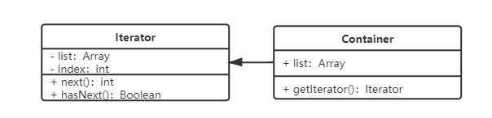

## 环境搭建

初始化：

```
cnpm i webpack webpack-cli webpack-dev-server html-webpack-plugin --save-dev
```

创建 webpack.dev.config.js 文件

```javascript
const path = require('path');
const htmlwebpackplugin = require('html-webpack-plugin');

module.exports = {
    entry: './src/index.js',
    output: {
        path: __dirname,
        filename: './release/bundle.js',
    },
    plugins: [
        new htmlwebpackplugin({
            template: './index.html',// 指定 html 模板
        }),
    ],
    devServer: {
        contentBase: path.join('__dirname', './release'), // 指定服务的根目录
        open: true, // 自动打开浏览器
        port: 9000,
    },
};

```

package.json 修改启动命令

```javascript
"script": {
    "dev":"webpack-dev-server --config ./webpack.dev.config.js --mode development"
}
```


解析es6，安装 babel

```
cnpm i @babel/core @babel/preset-env @babel/preset-react babel-loader
```

根目录创建 .babelrc 文件

```json
{
    "presets":['@babel/react','@babel/env'],
    "plugins":[]
}
```


## 面向对象

面向对象三要素

* 继承

* 封装：public 完全开放、protected 对子类开放、private 对自己开放

  减少耦合

  利于数据、接口的权限管理

  ES6目前不支持，一般认为 _开头的属性是 private

* 多态：重载、重写

  保持子类的开放性和灵活性

  面向接口编程

面向对象 JS 应用举例

```javascript
class jQuery {
    constructor(selector) {
        let slice = Array.prototype.slice;
        let dom = slice.call(document.querySelectorAll(selector));
        let len = dom ? dom.length : 0;
        for(let i = 0; i < len; i++) {
            this[i] = dom[i]
        }
        this.length = len
        this.selector = selector || '';
    }
    append(node) {
        // ..
    }
    addClass(name) {
        // ..
    }
    html(data) {
        // ...
    }
}
window.$ = function(selector) {
    return new jQuery(selector);
}
```


### UML 类图

泛化：类的继承

关联：类的组合、引用

+public/#protected/-private	


## 设计原则

《UNIX/LINUX 设计哲学》中的设计准则：

1. 小即是美
2. 让每个程序只做好一件事
3. 快速建立原型：根据反馈来完善而不是一开始就做一个完美的东西
4. 舍弃稿效率而取可移植性：效率和可移植性的取舍
5. 采用纯文本来存储数据：效率和可读性的取舍
6. 利用软件的杠杆效应（软件复用）
7. 使用 shell 脚本来提高杠杆效应和可移植性
8. 避免强制性的用户界面
9. 让每个程序都称为过滤器


### 五大设计原则

S-单一职责原则：一个程序只做好一件事，如果功能过于复杂就拆分开，每个部分保持独立。

O-开放封闭原则：扩展开放，修改封闭。增加需求时，扩展新代码，而非修改已有代码。

L-里氏置换：子类能覆盖父类，弗雷能出现的地方子类就能出现。JS中使用较少（弱类型&继承使用较少）

I-接口独立原则：保持接口单一独立，避免出现"胖接口"。JS中没有接口，使用较少。

D-依赖倒置：面向接口编程，依赖于抽象而不依赖于具体。只关注接口而不关注具体类的实现。JS中使用较少(没有接口&弱类型)


javascript 中 SO 体现较多，LID 体现较少，但要了解其用意。


## 工厂模式

### 介绍

* 将 new 操作单独封装
* 遇到 new 时，就要考虑是否应使用工厂模式


### 类图


### 代码实现

```javascript
class Product {
    constructor(name) {
        this.name = name;
    }
    init() {
    	alert('init');
    }
    fun1() {
        alert('fun1');
    }
    fun2() {
        alert('fun2');
    }
}

class Creator {
    create(name) {
        return new Product(name); 
    }
}
```


### 使用场景

* jQuery - $('div')

  ```javascript
  // 这里的函数相当于工厂
  window.$ = function(selector) {
      return new jQuery(selector);
  }
  ```

* React.createElement 生成一个 vnode 实例

```javascript
class Vnode(tag,attrs,chilren) {
    //...
}
React.createElement = function (tag,attrs,children) {
    return new Vnode(tag,attrs,children);
}
```

* vue 异步组件

```javascript
Vue.component('async-example',(resolve,reject) => {
    setTimeout(() => {
        resolve({
            template:'<div>I am a async component</div>'
        })
    },1000)
})
```


### 设计原则验证

* 构造函数和创建者分离

* 符合开放封闭原则


## 单例模式

### 介绍

* 系统中被唯一使用

* 一个类只能初始化一个实例


### 类图


### 代码演示

用 java 实现的单例模式演示

```java
public class SingleObject {
    // 一个私有化的构造函数，因此只能在内部 new
    private SingleObject() {}
    private SingleObject instance = null;
    // 获取实例的唯一接口
    public SingleObject getInstance() {
        if(instance == null) {
            instance = new SingleObject(); // 只 new 一次
        }
        return instance;
    }
}
```

由于单例模式需要用到 private 这个特性，ES 中没有这个特性，不过可以使用 js 闭包的特性来实现

```javascript
class SingleObject {
    testmethod() {
        console.log('test');
    }
}
SingleObject.getInstance = (function () {
    let instance = null;
    return function() {
    	if(instance == null) {
            instance = new SingleObject();
        }   
        return instance
    }
})();
```

因为单例模式只有一个实例，所以只需要判断你所创建出来的实例是否完全相同即可，可以如下面代码一样测试：

```javascript
const s1 = SingleObject.getInstance();
s1.testMethod(); // => 'test'
const s2 = SingleObject.getInstance();
s2.testMethod(); // => 'test'
console.log(s1 === s2); // => true 输出为 true 说明是同一个实例
```

需要注意的是，由于没有 private 这个禁止了外部 new 的限制，因此这里直接`new SingleObject()`也是可以创建实例的，只不过这样创建实例和普通类创建实例没什么区别。


### 使用场景

* jQuery 中只有一个 $

```javascript
if(window.jQuery != null) {
    return window.jQuery
}else {
    // 初始化
}
```

* vuex 和 redux 中的 store( 或 store 里的 state )


### 设计原则验证

* 符合单一职责原则， 只能实例化唯一的对象。
* 虽然没法具体体现开放封闭原则，但也不违反开放封闭原则。


## 适配器模式

### 介绍

旧的接口格式和使用者不兼容，在他们中间加一个适配来转换

日常例子：插排插头的适配器


### 类图


### 代码演示

```javascript
class Adaptee {
    specificRequest() {
        return `德国标准插头`;
    }
}

class Target {
    constructor() {
        this.adaptee = new Adaptee();
    }
    request() {
        let info = this.adaptee.specificRequest();
        return `${info} - 转换器 - 中国标准插头`
    }
}
// 测试
let target = new Target();
let res = target.request();
console.log(res);
```


### 使用场景

* vue 的 computed

```javascript
const vm = new Vue({
	el:'#app',
	data: {
		message:'hello'
	},
	computed: {
		reversMessage:function () {
			return message.split('').reverse().joi n('');
		}
	}
})
```


* 旧接口的封装

假如项目中的请求库需要更换，你封装了这么一个方法

```javascript
axios({url:'xxx',data:{},type:'post'}).done(() => {
    // ... 
})
```

这时候假如之前项目里用的请求库是 jquery 的 ajax 请求，项目里就会有很多 `$.ajax({...})`的请求代码，这时候就可以写一个适配器来转换，如下：

```javascript
var $ = {
    // ...
    ajax:function(data) {
        return axios(data);
    } 
}
```


### 设计原则验证

* **将旧接口与使用者分离**
* **符合开放封闭原则**


## 装饰器

### 介绍

* 为对象添加新功能
* 不改变其原有的结构和功能


### 类图


### 代码演示

```javascript
class Circle {
    draw() {
        console.log('画了一个圆');
    }
}

class Decorator {
    constructor(circle) {
        this.circle = circle;
    }
    draw() {
        this.circle.draw();
        this.setRedBorder();
    }
    setRedBorder() {
        console.log('添加红色边框')
    }
}
// 测试
let circle = new Circle();
circle.draw(); // => 画了一个圆
let dec = new Decorator(circle);
dec.draw(); // => 画了一个圆  添加红色边框
```


### 使用场景

* ES7 装饰器模式

  装饰类

  ```javascript
  @testDec
  class Demo {
      
  }
  function testDec(target) {
      target.isDec = true;
  }
  alert(Demo.isDec);
  ```

  

* core-decorators 一个用于提供装饰器的库，如给某个方法提供一些常用装饰。

  ```
  npm i core-decorators --save-dev
  ```

  ```javascript
  import { readonly, deprecate } from 'core-decorators';
  class Person {
      @readonly
      @deprecate('即将废弃', { url: 'www.baidu.com' })
      print() {
          return 'zhangsan';
      }
  }
  
  let p = new Person();
  p.print();
  p.print = function () {}; // => 报错
  ```


### 设计原则验证

* 将现有对象和装饰器分离，两者独立存在
* 符合开放封闭原则


## 代理模式

### 介绍

* 使用者无权直接访问目标对象
* 在使用者和目标对象中间加代理，通过代理来做授权和控制


### 类图


###  代码演示

```javascript
class RealImg {
    constructor(filename){
        this.filename = filename;
        this.loadImg();
    }
    display() {
        console.log('display... ' + this.filename);
    }
    loadImg() {
        console.log('loading... ' + this.filename)
    }
}

class ProxyImg {
    constructor(filename) {
        this.realImg = new RealImg(filename);
    }
    display() {
        this.realImg.display();
    }
}
// 测试代码
let proxyImg = new ProxyImg('1.png');
proxyImg.display();
```


### 使用场景

* 网页事件代理（事件委托）

```html
<div id="proxy">
    <a href="#">a1</a>
    <a href="#">a2</a>
    <a href="#">a3</a>
    <a href="#">a4</a>
    <a href="#">a5</a>
</div>
```

```javasc
<script>
	var proxy = document.getElementById('proxy');
	proxy.addEventListener('click',function(e) {
		var target = e.target;
		if(target.nodeName === 'A') {
			alert(target.innerHTML);
		}
	})
</script>
```


* jQuery 中的 $.proxy

下面这个例子中的 this 是不符合预期的，this 会指向 window。

```javascript
$('#proxy').click(function() {
    setTimeout(function() {
        $(this).addClass('red');
    },1000)
})

```

一般的解决方法：

```javascript
$('#proxy').click(function() {
    var _this = this;
    setTimeout(function() {
        $(_this).addClass('red');
    },1000)
})
```

使用 $.proxy：

```javascript
$('#proxy').click(function() {
    var fn = function() {
        $(this).addClass('red');
    }
    fn = $.proxy(fn,this);
    setTimeout(fn,1000);
})
// 简化后：
$('#proxy').click(function() {
    setTimeout($.proxy(function() {
        $(this).addClass('red')
    },this),1000)
})
```


* ES6 新特性 Proxy


### 设计原则验证

* 代理类和目标类分离，隔离开目标类和使用者
* 符合开放封闭原则


### 和类似的设计模式的区别

* **代理模式和适配器模式的区别**

  1. 适配器模式提供的接口和目标类不同，是对目标类接口的转换（类似不同的插头），而代理模式提供的是一模一样的接口。

  2. 代理模式是无权使用目标类的，但可以通过代理来做到直接使用目标类的效果。而适配器模式可以使用目标类，但是由于某些原因无法使用，所以需要通过适配器来做转换使得可以达到目标类的效果。


* **代理模式和装饰器模式的区别**

  装饰器模式不会改变目标类原有功能的使用，同时可以给原有功能进行扩展。而代理模式可以看作是对目标类原有功能进行了限制或阉割。

  可以简单理解成装饰器模式更适合对目标类进行扩展，代理模式更适合对目标类进行控制。


## 观察者模式

### 介绍

* 前端最常用的设计模式

* 发布-订阅
* 一对多


### 类图


### 代码演示

```javascript
class Subject() {
    constructor() {
        this.state = 0;
        this.observers = []
    }
    getState() {
        return this.state;
    }
    setState(state) {
        this.state = state
        this.notifyAllObeservers();
    }
    notifyAllOberservers() {
        this.observers.forEach(observer => {
            observer.update();
        })
    }
    attach(observer) {
        this.observers.push(observer);
    }
}

class Observer {
    constructor(name,subject) {
        this.name = name;
        this.subject = subject;
        this.subject.attch(this);
    }
    update() {
        console.log(`${this.name} state is update to ${this.subject.state}`)
    }
}
// 测试代码
let s = new Subject();

let o1 = new Observer('o1',s);
let o2 = new Observer('o2',s);
s.setState(2);
s.setState(3);

```


### 使用场景

* 网页事件绑定

  ```html
  <button id="btn1">btn</button>
  <script>
  	$('#btn1').click(function() {
          console.log(1);
      })
  </script>
  ```

* Promise

  promise 中的 `.then` 事实上就是在 promise 的状态变更的时候触发的。

  ```javascript
  var src = 'http://xxx.com/static/img/logo.png';
  var result = loadImg(src); // 假设 loadImg 为一个异步处理函数
  result.then(function (img) {
      console.log('width',img.width);
  }).then(function(img) {
      console.log('height',img.height)
  })
  ```

  

* jQuery callbacks

  ```html
  <script src='jquery.js'></script>
  <script>
  	var callbacks = $.Callbacks();
      callbacks.add(function (info) {
          console.log('fn1',info);
      })
      callbacks.add(function (info) {
          console.log('fn2',info);
      })
      
      callbacks.fire('go');
      callbacks.fire('fire');
  </script>
  // log => 'fn1 go' 'fn2 go' 'fn1 fire' 'fn2 fire'
  ```

* nodejs 自定义事件

  ```javascript
  const EventEmitter = require('events').EventEmitter;
  const emitter = new EventEmitter();
  
  emitter.on('some',() => { // 监听 some 事件
      console.log('some event is emit once');
  })
  emitter.on('some',() => { // 监听 some 事件
      console.log('some event is emit twice');
  })
  emitter.emit('some'); // 触发事件
  ```

  任何的 class 或构造函数都能继承 EventEmitter 的 on 和 emit 方法

  ```javascript
  const EventEmitter = require('events').EventEmitter;
  class Dog extends EventEmitter {
      constructor(name) {
          super();
          this.name = name;
      } 
  }
  var simon = new Dog('simon');
  simon.on('bark',barkLike => {
      console.log(this.name,barkLike)
  })
  setInterval(() => {
      simon.emit('bark','woff woff woff');
  }.1000)
  ```

  node 中的 Stream 模块用到了自定义事件

  ```javascript
  const readStream = fs.createReadStream('01.txt');	
  let length = 0;
  readStream.on('data',function(chunk) => {
  	length += chunck.toString().length              
  })
  readStream.on('end',function() => {
  	console.log(length);
  })
  ```

* nodejs中处理 http 请求，多进程通讯
* vue 和 React 组件生命周期触发
* vue watch


### 设计原则验证

* 主题和观察者分离，不是主动触发而是被动监听，两者解耦
* 符合开放封闭原则


## 迭代器模式

### 介绍

* 顺序访问一个集合
* 使用者无需知道集合的内部结构(封装)


### 类图




### 代码演示

```javascript
// 集合容器
class Container {
    constructor(list) {
        this.list = list
    } 
    getIterator() {
        return new Iterator(this);
    }
}

// 迭代器
class Iterator {
    constructor(container) {
        this.list = container.list
        this.index = 0;
    }
    next() {
        if(this.hasNext()) {
            return this.list[this.index++];
        }
        return null
    }
    hasNext() {
        if(this.index >= this.list.length) {
            return false
        }
        return true
    }
}

// 测试代码
let arr = [1, 2, 3, 4, 5, 6, 7];
let container = new Container(arr);
let it = new Iterator(container);
while (it.hasNext()) {
    console.log(it.next());
}
```


### 场景

* jQuery each ：编写一个函数能够同时遍历数组、node 节点、和 jQuery 元素

  ```html
  <div>
      <p>jquery each</p>
      <p>jquery each</p>
      <p>jquery each</p>
  </div>
  <script>
  	var arr = [1,2,3];
      var nodeList = document.getElementByTagName('p');
      var $p = $('p');
      function each(data) {
          // jquery 中有迭代方法 each
          // 可以将 data 变成一个 jquery 对象，使用 each 遍历
          var $data = $(data);
          $data.each(function(key,value) {
              console.log('key:',key,'value:',value);
          })
      }
      each(arr);
      each(nodeList);
      each($p);
  </script>
  ```

* **ES6 Iterator**

  **为何 ES6 中要有Iterator** ：ES6 中，有序集合的数据类型有很多（Array / Map / Set / String / arguments / NodeList），传统的`for` 和 `for...in` 只能简单地遍历数组或对象，因此需要有一个统一的遍历接口，可以用来遍历所有的有序数据集合。

  > 注意：Object 不是有序数据集合，可以用 Map 代替

  **Iterator 是什么：**有序集合原型上都具有`[Symbol.iterator]`属性，其属性值为一个函数，执行这个函数就会返回一个迭代器，这个迭代器有 `next` 方法可以顺序迭代子元素。

  ```javascript
  // 示例：
  function each(data) {
      let iterator = data[Symbol.iterator]();
      let item = {done:false}
      while(!item.done) {
          item = iterator.next();
          if(!item.done) {
              console.log(item.value);
          }
      }
  }
  // 演示数组和字符串结构，其他有序集合也可以
  let arr = [1, 2, 3, 4, 5, 6];
  let str = '123456';
  each(arr);
  each(str);
  ```

  但是由于 ES6 的 `Symbol.Iterator`不是每个人都知道，每次实现都要使用这个属性的化未免太麻烦，因此 ES6 提供了 `for...of`，可以用来遍历所有具有 Iterator 接口的数据结构。

  ```javascript
  function each(data) {
      for(let item of data) {
          console.log(item);
      }
  }
  // 演示数组和字符串结构，其他有序集合也可以
  let arr = [1, 2, 3, 4, 5, 6];
  let str = '123456';
  each(arr);
  each(str);
  ```


### 设计模式验证

* 迭代器对象和目标对象分离
* 迭代器将使用者和目标对象隔离开
* 符合开放封闭原则 